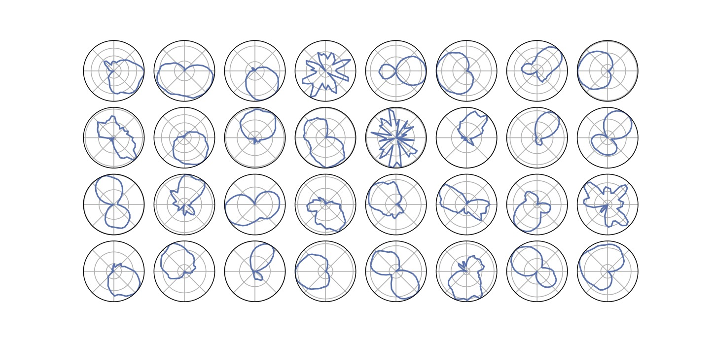

## Semi-Supervised Machine Condition Monitoring by Learning Deep Discriminative Audio Features

This repository containes the source code along with the detailed results and visualization of the research study 

Thoidis, I.; Giouvanakis, M.; Papanikolaou, G. Semi-Supervised Machine Condition Monitoring by Learning Deep Discriminative Audio Features. Electronics 2021, 10, 2471. https://doi.org/10.3390/electronics10202471

Laboratory of Electroacoustics and TV Systems,

School of Electrical and Computer Engineering, 

Faculty of Engineering, 

Aristotle University of Thessaloniki, 

Greece

### Abstract

In this study, we aim to learn highly descriptive representations for a wide set of machinery sounds and exploit this knowledge to perform condition monitoring of mechanical equipment. We propose a comprehensive feature learning approach that operates on raw audio, by supervising the formation of salient audio embeddings in latent states of a deep temporal convolutional neural network. By fusing the supervised feature learning approach with an unsupervised deep one-class neural network, we are able to model the characteristics of each source and implicitly detect anomalies in different operational states of industrial machines. Moreover, we enable the exploitation of spatial audio information in the learning process, by formulating a novel front-end processing strategy for circular microphone arrays. Experimental results on the MIMII dataset demonstrate the effectiveness of the proposed method, reaching a state-of-the-art mean AUC score of 91.0%. Anomaly detection performance is significantly improved by incorporating multi-channel audio data in the feature extraction process, as well as training the convolutional neural network on the spatially invariant front-end. Finally, the proposed semi-supervised approach allows the concise modeling of normal machine conditions and accurately detects system anomalies, compared to existing anomaly detection methods.

## Dataset Distribution


## Discriminative embeddings on MIMII samples


## Spatial filtering patterns of the of the 1st convolutional layer of RawdNet



### Reference

```
@Article{electronics10202471,
AUTHOR = {Thoidis, Iordanis and Giouvanakis, Marios and Papanikolaou, George},
TITLE = {Semi-Supervised Machine Condition Monitoring by Learning Deep Discriminative Audio Features},
JOURNAL = {Electronics},
VOLUME = {10},
YEAR = {2021},
NUMBER = {20},
ARTICLE-NUMBER = {2471},
URL = {https://www.mdpi.com/2079-9292/10/20/2471},
ISSN = {2079-9292},
DOI = {10.3390/electronics10202471}
}
```

### Notes

* If using this code, parts of it, or developments from it, please cite the above reference.
* We do not provide any support or assistance for the supplied code nor we offer any other compilation/variant of it.
* We assume no responsibility regarding the provided code.


